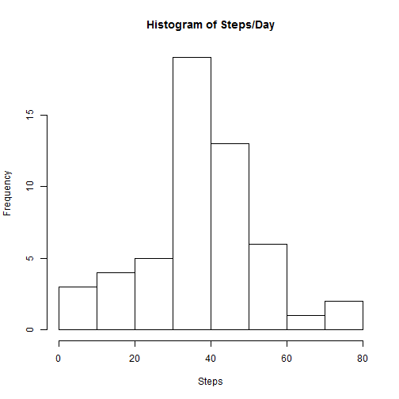
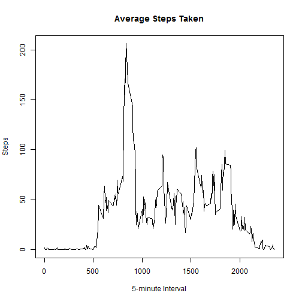
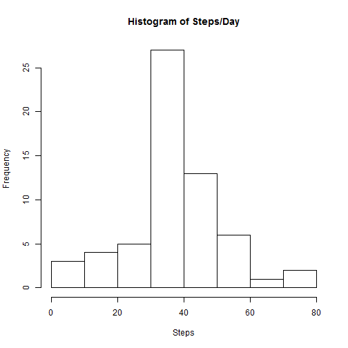

Step-1: set-up environment, download & unzip file, import as data frame

```r
library(plyr)
library(lattice)
setInternet2(TRUE)
download.file(url = "https://d396qusza40orc.cloudfront.net/repdata%2Fdata%2Factivity.zip",destfile = "temp")
unzip("temp","activity.csv")
data <- read.csv("activity.csv")
```
Step-2: process data for further use

```r
hour <- trunc(data$interval/100)
data$datetime <- paste(data$date,":",hour,":",data$interval - 100*hour,sep="")
data$datetime <- strptime(data$datetime,"%Y-%m-%d:%H:%M")
```
Step-3: calc mean, median, and produce histogram

```r
avedata <- na.omit(aggregate(data$steps, by =list(as.Date(data$datetime)),FUN = mean,na.action=na.omit))
avedata <- rename(avedata,c("Group.1"="date","x"="steps"))
format(avedata,digits=4)
```

```
##          date   steps
## 2  2012-10-02  0.4375
## 3  2012-10-03 39.4167
## 4  2012-10-04 42.0694
## 5  2012-10-05 46.1597
## 6  2012-10-06 53.5417
## 7  2012-10-07 38.2465
## 9  2012-10-09 44.4826
## 10 2012-10-10 34.3750
## 11 2012-10-11 35.7778
## 12 2012-10-12 60.3542
## 13 2012-10-13 43.1458
## 14 2012-10-14 52.4236
## 15 2012-10-15 35.2049
## 16 2012-10-16 52.3750
## 17 2012-10-17 46.7083
## 18 2012-10-18 34.9167
## 19 2012-10-19 41.0729
## 20 2012-10-20 36.0938
## 21 2012-10-21 30.6285
## 22 2012-10-22 46.7361
## 23 2012-10-23 30.9653
## 24 2012-10-24 29.0104
## 25 2012-10-25  8.6528
## 26 2012-10-26 23.5347
## 27 2012-10-27 35.1354
## 28 2012-10-28 39.7847
## 29 2012-10-29 17.4236
## 30 2012-10-30 34.0938
## 31 2012-10-31 53.5208
## 33 2012-11-02 36.8056
## 34 2012-11-03 36.7049
## 36 2012-11-05 36.2465
## 37 2012-11-06 28.9375
## 38 2012-11-07 44.7326
## 39 2012-11-08 11.1771
## 42 2012-11-11 43.7778
## 43 2012-11-12 37.3785
## 44 2012-11-13 25.4722
## 46 2012-11-15  0.1424
## 47 2012-11-16 18.8924
## 48 2012-11-17 49.7882
## 49 2012-11-18 52.4653
## 50 2012-11-19 30.6979
## 51 2012-11-20 15.5278
## 52 2012-11-21 44.3993
## 53 2012-11-22 70.9271
## 54 2012-11-23 73.5903
## 55 2012-11-24 50.2708
## 56 2012-11-25 41.0903
## 57 2012-11-26 38.7569
## 58 2012-11-27 47.3819
## 59 2012-11-28 35.3576
## 60 2012-11-29 24.4688
```

```r
hist(avedata$steps,main ="Histogram of Steps/Day",xlab="Steps",ylab="Frequency")
```

 

```r
paste("mean of steps per day =",format(mean(avedata$steps),digits=6))
```

```
## [1] "mean of steps per day = 37.3826"
```

```r
paste("median of steps per day =",format(median(avedata$steps),digits=6))
```

```
## [1] "median of steps per day = 37.3785"
```
Step-4: Create time series plot of average number of steps taken, averaged across all days.
Determine interval with maximum activity.

```r
avedata <- na.omit(data)
avedata <- aggregate(avedata$steps, by =list(avedata$interval),FUN = mean)
avedata <- rename(avedata,c("Group.1"="interval","x"="steps"))
plot(x = avedata$interval,y = avedata$steps,type="l",main ="Average Steps Taken",xlab="5-minute Interval",ylab="Steps")
```

 

```r
paste("Maximum activity occurs during interval",data$interval[which.max(avedata$steps)])
```

```
## [1] "Maximum activity occurs during interval 835"
```
Step-5: Calc number of NAs. Strategy for filling NAs and fill NAs in new dataset. I replaced the NAs with the mean of all
intervals for all days. Compare to original dataset.Determine interval with maximum activity.

```r
paste("total number of missing data values =",sum(is.na(data$steps)))
```

```
## [1] "total number of missing data values = 2304"
```

```r
newdata <- data
newdata[is.na(newdata)] <- mean(newdata$steps,na.rm=TRUE)
avenewdata <- na.omit(aggregate(newdata$steps, by =list(as.Date(newdata$datetime)),FUN = mean,na.action=na.omit))
avenewdata <- rename(avenewdata,c("Group.1"="date","x"="steps"))
format(avenewdata,digits=4)
```

```
##          date   steps
## 1  2012-10-01 37.3826
## 2  2012-10-02  0.4375
## 3  2012-10-03 39.4167
## 4  2012-10-04 42.0694
## 5  2012-10-05 46.1597
## 6  2012-10-06 53.5417
## 7  2012-10-07 38.2465
## 8  2012-10-08 37.3826
## 9  2012-10-09 44.4826
## 10 2012-10-10 34.3750
## 11 2012-10-11 35.7778
## 12 2012-10-12 60.3542
## 13 2012-10-13 43.1458
## 14 2012-10-14 52.4236
## 15 2012-10-15 35.2049
## 16 2012-10-16 52.3750
## 17 2012-10-17 46.7083
## 18 2012-10-18 34.9167
## 19 2012-10-19 41.0729
## 20 2012-10-20 36.0938
## 21 2012-10-21 30.6285
## 22 2012-10-22 46.7361
## 23 2012-10-23 30.9653
## 24 2012-10-24 29.0104
## 25 2012-10-25  8.6528
## 26 2012-10-26 23.5347
## 27 2012-10-27 35.1354
## 28 2012-10-28 39.7847
## 29 2012-10-29 17.4236
## 30 2012-10-30 34.0938
## 31 2012-10-31 53.5208
## 32 2012-11-01 37.3826
## 33 2012-11-02 36.8056
## 34 2012-11-03 36.7049
## 35 2012-11-04 37.3826
## 36 2012-11-05 36.2465
## 37 2012-11-06 28.9375
## 38 2012-11-07 44.7326
## 39 2012-11-08 11.1771
## 40 2012-11-09 37.3826
## 41 2012-11-10 37.3826
## 42 2012-11-11 43.7778
## 43 2012-11-12 37.3785
## 44 2012-11-13 25.4722
## 45 2012-11-14 37.3826
## 46 2012-11-15  0.1424
## 47 2012-11-16 18.8924
## 48 2012-11-17 49.7882
## 49 2012-11-18 52.4653
## 50 2012-11-19 30.6979
## 51 2012-11-20 15.5278
## 52 2012-11-21 44.3993
## 53 2012-11-22 70.9271
## 54 2012-11-23 73.5903
## 55 2012-11-24 50.2708
## 56 2012-11-25 41.0903
## 57 2012-11-26 38.7569
## 58 2012-11-27 47.3819
## 59 2012-11-28 35.3576
## 60 2012-11-29 24.4688
## 61 2012-11-30 37.3826
```

```r
hist(avenewdata$steps,main ="Histogram of Steps/Day",xlab="Steps",ylab="Frequency")
```

 

```r
paste("mean of steps per day =",format(mean(avenewdata$steps),digits=6))
```

```
## [1] "mean of steps per day = 37.3826"
```

```r
paste("median of steps per day =",format(median(avenewdata$steps),digits=6))
```

```
## [1] "median of steps per day = 37.3826"
```
Step-6: Create new factor variable for weekdays/weekends. Make a panel plot of weekend/weekday 5-minute data.

```r
newdata$weekend <- weekdays(newdata$datetime)=="Saturday" | weekdays(newdata$datetime)=="Sunday"
newdata$weekend <- factor(newdata$weekend, labels = c("weekday","weekend"))
avedata <- aggregate(newdata$steps, by =list(newdata$interval,newdata$weekend),FUN = mean)
avedata <- rename(avedata,c("Group.1"="interval","Group.2"="weekend","x"="steps"))
xyplot(avedata$steps~avedata$interval|avedata$weekend,type='l',layout=(c(1,2)),xlab="Interval",ylab="Number of steps")
```

 
